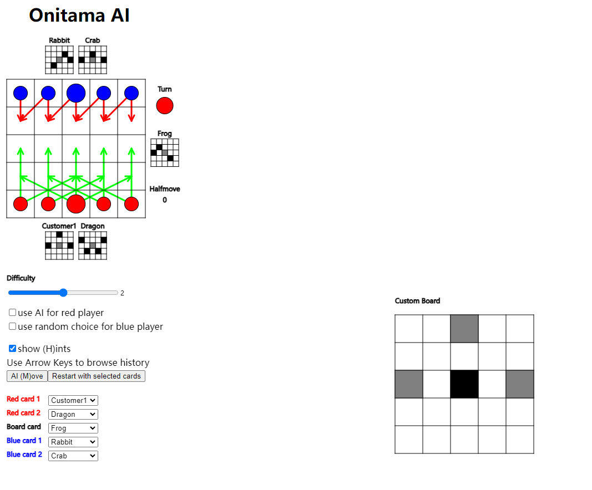

# Project Introduction
Final project & Selfish motive to start learning JavaScript :satisfied:

The onitama game is from [Arcane Wonders](https://www.arcanewonders.com/product/onitama/).

This project is adapted from [Luis' work](https://github.com/LuisEduardoReis/Onitama). 	:sunglasses:Standing on the shoulders of giants.

Use the library from [p5.js](https://p5js.org/)
- Add some new features
  - Add difficulty selection
  - Random choice by Computer
- Rewrite the A.I. algorithm totally
- Improve the evaluation system
  - Add the distance calculation between master pawn and student pawn
  - Add the distance calculation between pawns and original position of opponent's master 
pawn
- Change some game rules
  - Customize the card by user interface (Allow one for now, hard to build UI :thinking:)
  - Win condition: move both kinds of pawn on to the original position of opponent's master pawn
  - Abandoned plans
    - Change the initial position of the pawns (the game board is too small, little changes 
will make the game end faster and the A.I. can't get enough data)
    - Add gameplay "way of the wind" from extension pack (don't know the specific rules)

### UI

## Project Analysis:
A.I. algorithm uses Minimax and the depth can be 2, 4 or 6 based on the different difficulty level.

Time Complexity for each step O(b^d)

b: the options for each step(from 1 to 24)
d: search depth (2, 4 or 6)

When depth is 4 (With in 0.2ms)

When depth is 6 (With in 0.5ms)

Evaluation function
- The number difference between pawns from two sides (Time Complexity: O(1))
- The distance calculation between master pawn and student pawn (Time Complexity: O(n))
- The distance calculation between pawns and original position of opponent's master (Time Complexity: O(n))